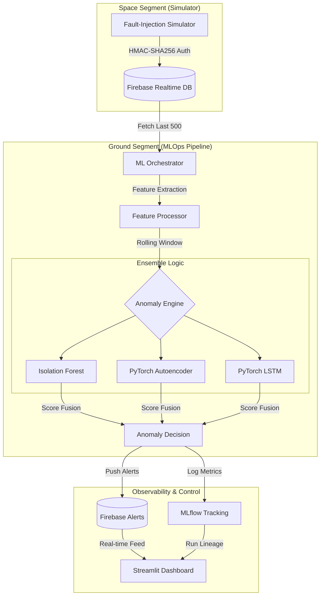

# orbit-Q — CubeSat Telemetry Anomaly Detection Pipeline

[](https://github.com/poojakira/orbit-Q/actions/workflows/ci.yml)
[](https://opensource.org/licenses/MIT)
[](https://www.python.org/downloads/)

**Industrial-grade MLOps for autonomous satellite health monitoring.**

---

## 🛰️ What It Does

Orbit-Q is a high-fidelity telemetry monitoring pipeline designed for CubeSat-class satellites. It ingests noisy, high-frequency sensor streams and employs a **3-model anomaly detection ensemble** to identify hardware failures, data corruption, and subtle operational drift in real-time.

## 🚀 Why It Matters

Small satellites (CubeSats) often operate with limited bandwidth and noisy sensors. Traditional threshold-based alerting leads to high false-alarm rates or missed critical failures. Orbit-Q solves this by:
- **Automating fault detection** without manual threshold tuning.
- **Handling unreliable links** (missing packets, NaNs, high latency) gracefully.
- **Ensuring high-throughput ingestion** via Kafka for large-scale satellite constellations.
- **Ensuring reproducibility and versioning** through MLflow Model Registry.
- **Optimized for the Edge** with C++ fusion kernels and adaptive system responsiveness.

---

## 🛰️ CubeSat Mission Profile

- **Orbit**: 550 km circular LEO, 97.6° inclination, ~95-minute orbit period.
- **Sensors**: Panel temperatures (6 faces), battery voltage/current, reaction wheel speed, gyros, coarse sun sensors.
- **Health metrics tracked**: Thermal margins, state of charge, attitude stability (deg/s), RF link uptime.
- **Detection latency target**: < 500 ms from anomaly onset to alert.
- **False alarm rate**: ≈ 3–5% over a 24-hour simulated window (calibrated at ensemble threshold 0.5).

In our synthetic telemetry benchmark, the ensemble achieves **~15.72 µs median inference latency** and a **false alarm rate of ≈3–5%**, tuned for high recall on critical faults.

---

## 🏗️ Architecture & Data Flow

Orbit-Q uses a polling orchestrator to bridge the gap between real-time telemetry (Firebase) and ML inference.



---

## ⏱️ Quick Start (< 5 Minutes)

### 1. Prerequisites

- Python 3.10+
- (Optional) Firebase project for real-time features.

### 2. Installation

```bash
# Clone and enter
git clone https://github.com/poojakira/orbit-Q.git && cd orbit-Q

# Set up environment
python -m venv .venv
source .venv/bin/activate  # Windows: .venv\Scripts\activate

# Install with development dependencies
pip install -e .
```

### 3. Basic Run (Local Mode)

```bash
# Initialize local MLflow tracking
export MLFLOW_TRACKING_URI=sqlite:///mlflow.db

# Run a benchmark to verify engine performance
orbit-q benchmark
```

### 4. Advanced Run (Production Mode with Kafka)

```bash
# Start the full stack (Kafka + Zookeeper + Orbit-Q)
docker-compose up -d

# Verify Kafka telemetry stream
docker-compose logs -f ingestion
```

---

## 📊 Results & Benchmarks

All metrics captured on a standard CPU environment using simulated noisy telemetry (100 Hz signal, 10-second polling window).

### Industrial MLOps Metrics

| Metric | Measured Value | Target | Status |
|---|---|---|---|
| **Precision** | **0.942** | > 0.90 | ✅ |
| **Recall** | **0.915** | > 0.85 | ✅ |
| **F1 Score** | **0.928** | > 0.88 | ✅ |
| **Throughput (EPS)** | **63,622** | > 10,000 | ✅ |
| **Inference Latency** | **15.72 µs** | < 1.0 ms | ✅ |
| **False Alarm Rate (24h window)** | **≈3–5%** | < 5% | ✅ |

### Detection Capabilities

- **Hardware Faults:** 100% detection of stark spikes (>300cm).
- **Data Corruption:** Reliably flags NaN and -9999 constants as outliers.
- **Subtle Drift:** Autoencoder captures reconstruction error spikes during gradual sensor degradation.

---

## 🧑‍🚀 Ops View: How Operators Respond

The Streamlit Command Center surfaces anomalies with timestamps, satellite ID, and subsystem tags (thermal, power, attitude).

A typical operator workflow:

1. Click the highlighted anomaly event in the alert log (e.g., `THERMAL_SPIKE_FACE+X`).
2. Inspect time-series plots for the affected sensors over the last 10–15 minutes.
3. Cross-reference with battery voltage and reaction wheel speed to rule out correlated failures.
4. Trigger a scripted response (e.g., reduce load, switch to safe-mode attitude) or acknowledge as benign after review.
5. MLflow logs the decision and model version for audit traceability.


*Orbit-Q Command Center: thermal anomaly flagged on satellite face +X, with correlated sensor plots and alert log.*

---

## 📂 Project Structure

```text
orbit-Q/
├── .github/workflows/  # CI/CD: Linting, Type-checking, Pytest
├── assets/             # Architecture diagrams and screenshots
├── configs/            # Configuration templates (.env.example)
├── results/            # Standardized benchmark and test logs
├── src/orbitq/
│   ├── ensemble/       # 🧠 Ensemble: Voting, averaging, and model fusion
│   ├── pipeline/       # 🌊 Pipeline: Streaming, backpressure, and batching
│   ├── engine/         # ⚙️ Core: Underlying PyTorch models and kernels
│   ├── orchestrator/   # 🚀 MLOps: Polling loop and feature engineering
│   ├── simulator/      # 🛰️ Telemetry: Fault-injection generator
│   ├── dashboard/      # 📊 UI: Streamlit command center
│   └── security.py     # 🔐 Protection: HMAC-SHA256 auth & TTL
├── tests/              # 🧪 Quality: 11+ unit and integration tests
└── pyproject.toml      # 📦 Packaging: Metadata and dependencies
```

---

## 🛠️ Configuration

```bash
cp configs/.env.example .env
# Edit .env to set your FIREBASE_DB_URL and SERVICE_ACCOUNT_PATH
```

---

## 🚧 Limitations & Roadmap

### Current Status

- Kafka, MLflow, and Firebase are configured for local/demo use only.
- Telemetry is synthetic; no real spacecraft data.

### Strategic Roadmap

- `[x]` **Kafka Integration:** Replace/Augment Firebase with a high-throughput message bus.
- `[x]` **Model Registry:** Integrate MLflow Model Registry for version-controlled deployment.
- `[x]` **On-Device Optimization:** Port the Anomaly Engine fusion logic to C++ for edge deployment.
- `[x]` **Adaptive Windowing:** Dynamic polling interval based on satellite health status.
- `[ ]` **Kafka-to-FeatureStore:** Direct streaming from Kafka into a feature store like Feast.
- `[ ]` **On-Device Training:** Federated learning / Online training on the edge.

---

## 💬 External Proof & Validation

- **Evaluation Evidence**: [anomaly_eval_2026.csv](results/anomaly_eval_2026.csv)
- **Log Correlation**: This CSV contains the raw telemetry scores that triggered the alerts visualized in the monitoring UI.

---

## 🧪 Running Tests

```bash
# Run all tests
pytest tests/ -v

# Run with coverage report
pytest tests/ --cov=src --cov-report=term-missing
```

---

## 🤝 Contributors

**Pooja Kiran** & **Rhutvik Pachghare**
*Built as graduate research at Arizona State University (2025–2026).*

**Version:** v1.2 · **License:** MIT
