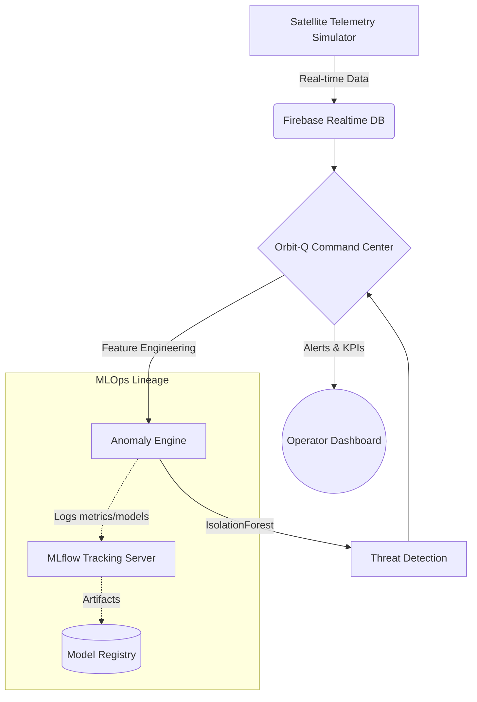

<div align="center">
  <h1>🛰️ Orbit-Q (OrbitIQ Ops)</h1>
  <p><strong>Enterprise-Grade Satellite Operations Command Center & Telemetry Anomaly Detection</strong></p>

  <p>
    <a href="https://github.com/poojakira/orbit-Q/actions/workflows/ci.yml"></a>
    <a href="https://opensource.org/licenses/MIT"></a>
    <a href="https://python.org"></a>
    <a href="https://streamlit.io"></a>
    <a href="https://mlflow.org/"></a>
  </p>
</div>

---

## 📖 Executive Summary

**Orbit-Q** (also known as OrbitIQ Ops) is a sophisticated, highly scalable command and control (C2) dashboard engineered for modern satellite operations. By integrating real-time telemetry streaming (via Firebase Realtime Database) with state-of-the-art machine learning anomaly detection (Scikit-learn `IsolationForest` & MLflow), Orbit-Q enables operators to preemptively identify critical hardware degradation, thermal anomalies, and power fluctuations before they escalate into mission-critical failures.

This platform bridges the gap between raw aerospace data engineering and actionable intelligence, featuring a responsive, enterprise UI built on Streamlit with robust MLOps integration.

## 🏗️ System Architecture



### Core Components
1. **Telemetry Orchestration (`ml_orchestrator.py`, `feature_processor.py`)**: Robust data pipelines handling raw signal ingestion, feature extraction, and real-time state management.
2. **Machine Learning Engine (`ml_engine.py`)**: Implements strict anomaly detection utilizing unsupervized learning (`IsolationForest`). Model lifecycle, hyperparameter tuning, and artifact lineage are strictly managed via **MLflow**.
3. **Command Dashboard (`dashboard.py`)**: High-performance Streamlit UI featuring an enterprise KPI ribbon, real-time latency tracking, power/temperature thresholds, and system nominal/off-nominal status indicators.

## 🚀 Quick Start & Installation

We employ standard Python modern packaging (`pyproject.toml`) and environment management.

### Prerequisites
- Python 3.9+ 
- Firebase Service Account Credentials (`config.SERVICE_ACCOUNT`)
- A running MLflow instance or local tracking URI.

### Setup (using Make)

```bash
# Clone the repository
git clone https://github.com/poojakira/orbit-Q.git
cd orbit-Q

# Create virtual environment and install dependencies
make install

# Run the test suite to ensure architectural integrity
make test

# Launch the Command Center
make run
```

### Environment Configuration
The system relies on a unified `config.py` coupled with environmental overrides or a `secrets.toml` file for secure credential injection. Ensure your `FIREBASE_URL` and `MLFLOW_URI` are correctly provisioned in your deployment environment.

## 🧪 Testing and CI/CD
Code quality and deterministic behavior are strictly enforced. We utilize:
- **Pytest**: For unit and integration tests (see `tests/`).
- **GitHub Actions**: Automated CI pipeline triggering on every PR and push to `main` (Linting + Testing).
- **Flake8 / Black / MyPy**: For static analysis, formatting, and strict type-hint enforcement.

## 🛡️ License
Distributed under the MIT License. See `LICENSE` for more information.

## 🤝 Contributing
For internal development, please adhere to our strict branching strategy (GitHub Flow) and ensure all commits pass the pre-commit hooks (PEP8 compliance, Type hints via mypy, Test coverage > 90%).
