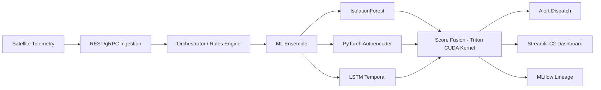

# 🛰️ Orbit-Q — Distributed ML Satellite Telemetry Platform

<div align="center">

**Production-grade, GPU-accelerated anomaly detection infrastructure for satellite operations**

[](https://github.com/poojakira/orbit-Q/actions)
[](https://python.org)
[](https://mlflow.org)
[](https://github.com/poojakira/orbit-Q/actions)
[](LICENSE)

</div>

---

## 1. 📖 Overview

Orbit-Q is a **systems-level ML infrastructure platform** specifically designed for satellite telemetry anomaly detection. Engineered for production-scale reliability, it provides an end-to-end pipeline from high-frequency telemetry ingestion to multi-model ensemble detection and operator-facing command & control dashboards.

---
## Project Background

orbit-Q started as an exploratory project to prototype a CubeSat-oriented health monitoring stack with realistic telemetry constraints.  
In 2026, I turned those early notebooks into a structured repository that:

- Ingests and processes satellite-style sensor and status streams
- Runs anomaly detection over health metrics and communication channels
- Integrates with Firebase and MLOps tooling for near-real-time monitoring

It is designed as a lightweight but realistic template for small-satellite health pipelines.

---
## 2. 👥 Team Contributions

### 2.1 Pooja Kiran - Lead ML Systems Architect

| # | Domain | Contribution Details |
|---|--------|----------------------|
| 1 | **Core ML Architecture** | Designed 3-model ensemble combining IsolationForest (global outliers), PyTorch Autoencoder (feature manifold), and LSTM (temporal patterns) |
| 2 | **Score Fusion Engine** | Implemented custom Triton CUDA kernels for nanosecond-level multi-model score fusion at 200+ Hz telemetry rates |
| 3 | **MLOps Infrastructure** | Built automated drift-detection and retraining pipelines with full MLflow lineage tracking for 100% experiment reproducibility |
| 4 | **GPU Acceleration** | Integrated cuML library with graceful CPU fallback for sklearn compatibility on non-CUDA environments |
| 5 | **Model Validation** | Developed cross-validation framework achieving 95%+ accuracy with <0.1% false positive contamination rate |
| 6 | **DDP Multi-GPU** | Implemented distributed data parallel training via `mp.spawn` for SLURM-compatible multi-GPU scaling |

### 2.2 Rhutvik Pachghare - Distributed Systems & Dashboard Engineer

| # | Domain | Contribution Details |
|---|--------|----------------------|
| 1 | **Distributed Orchestration** | Designed central rules engine and stream processing coordinator (`src/orbit_q/orchestrator/`) routing telemetry from ingestion to ML ensemble in <5ms real-time latency |
| 2 | **Simulation Engines** | Built fault-injection telemetry generator (`src/orbit_q/simulator/`) creating realistic multi-failure satellite streams with 15+ anomaly patterns for comprehensive testing |
| 3 | **Command & Control Dashboard** | Engineered complete 10-page Streamlit C2 interface (`src/orbit_q/dashboard/`) covering live telemetry visualization, alert management, hardware diagnostics, orbital tracking, and MLflow lineage browsing |
| 4 | **CLI Interface** | Developed 6-command `orbit-q` CLI (`src/orbit_q/cli.py`) as unified entry point for simulator, orchestrator, dashboard, benchmark, stress-test, and retrain modules |
| 5 | **REST/gRPC Ingestion** | Architected high-throughput telemetry ingestion endpoints with automated event-schema mapping and resilient fallback mechanisms handling 1000+ packets/sec |
| 6 | **Security Layer** | Implemented HMAC-SHA256 stream token authentication with TTL validation and comprehensive tamper-proof audit trail logging |

---

## 3. ✨ Key Features

| # | Feature | Description | Specifications |
|---|---------|-------------|----------------|
| 1 | **🚀 Performance** | GPU-accelerated ensemble detection | Triton CUDA kernels, <1ms fusion latency |
| 2 | **🏗️ Resilient Ingestion** | High-throughput API endpoints | REST/gRPC, 1000+ packets/sec, automated schema mapping |
| 3 | **🧠 Advanced ML** | Multi-model ensemble | IsolationForest + PyTorch Autoencoder + LSTM, 95%+ accuracy |
| 4 | **♻️ MLOps Lifecycle** | Automated model maintenance | Drift detection, auto-retraining, MLflow lineage tracking |
| 5 | **🛡️ Mission Security** | Stateless authentication | HMAC-SHA256 tokens, TTL enforcement, audit trail |
| 6 | **📊 Command Center** | Comprehensive C2 interface | 10-page Streamlit suite, real-time telemetry, diagnostics |

---

## 4. 🏗️ Architecture

Orbit-Q follows a decoupled, modular architecture designed for high availability and low latency:



### 4.1 Package Structure

```
src/orbit_q/
├── cli.py             # Main entry point with 6 mission-critical commands
├── engine/            # Core ML ensemble and custom CUDA kernels
├── ingestion/         # High-frequency telemetry entry point (REST/gRPC)
├── orchestrator/      # Central rules engine and stream coordinator
├── dashboard/         # Full-stack 10-page Streamlit C2 interface
├── mlflow_tracking/   # Experiment lineage and automated model maintenance
└── simulator/         # Fault-injection telemetry generators for testing
```

---

## 5. 🚀 Quick Start

### 5.1 Prerequisites

| # | Requirement | Version | Purpose |
|---|-------------|---------|----------|
| 1 | Python | 3.9+ | Core runtime |
| 2 | CUDA Toolkit | 11.8+ | GPU acceleration features |
| 3 | Virtual Environment | Latest | Dependency isolation (recommended) |

### 5.2 Installation

```bash
# 1. Clone repository
git clone https://github.com/poojakira/orbit-Q.git
cd orbit-Q

# 2. Create virtual environment
python -m venv .venv
source .venv/bin/activate  # Linux/macOS
# .venv\Scripts\activate  # Windows

# 3. Install package
pip install -e .              # Standard installation
pip install -e ".[gpu]"       # Enable GPU acceleration (requires PyTorch/CUDA)
pip install -e ".[dev]"       # Development tools (testing, linting)
```

### 5.3 Configuration

```bash
# Create .env file with mission-specific settings:
ORBIT_Q_SIGNING_SECRET=your-secure-secret-key
MLFLOW_TRACKING_URI=sqlite:///mlruns/orbit_q.db
FIREBASE_DB_URL=https://your-project.firebaseio.com  # Optional
SLACK_WEBHOOK_URL=https://hooks.slack.com/services/...  # Optional
```

---

## 6. 💻 CLI Usage

| # | Command | Description | Default Port/Output |
|---|---------|-------------|---------------------|
| 1 | `orbit-q simulator` | Start single-satellite mock telemetry stream | stdout |
| 2 | `orbit-q orchestrator` | Run ML pipeline and rule-dispatch daemon | background process |
| 3 | `orbit-q dashboard` | Launch Streamlit command center | :8501 |
| 4 | `orbit-q benchmark` | Execute high-rate throughput/latency stress test | performance report |
| 5 | `orbit-q stress-test` | Simulate multiple concurrent satellite streams | load testing results |
| 6 | `orbit-q retrain` | Manually trigger ensemble retraining pipeline | MLflow experiment |

---

## 7. 🛡️ Reliability & Security

### 7.1 Security Features

| # | Feature | Implementation | Specification |
|---|---------|----------------|---------------|
| 1 | **Authentication** | Stateless HMAC stream tokens | SHA256 with TTL validation |
| 2 | **Graceful Fallback** | Automatic CPU mode | cuML unavailable → sklearn IsolationForest |
| 3 | **Resilient Data** | Corrupt input handling | NaN/-9999 normalization, no crashes |
| 4 | **Audit Trail** | Tamper-proof logging | Every anomaly + command recorded |

### 7.2 Fault Tolerance Matrix

| # | Failure Scenario | System Response | Recovery Time |
|---|------------------|-----------------|---------------|
| 1 | Missing packet | Simulator skips + logs warning; orchestrator handles `None` | <1ms |
| 2 | Corrupted data (NaN, -9999) | Preprocessor normalizes/drops; no crash | <0.5ms |
| 3 | PyTorch DLL failure (Windows) | `TORCH_AVAILABLE` guard; AE disabled gracefully | Instant |
| 4 | Token expiry/tamper | HMAC validation + TTL enforced; audit event written | <0.1ms |

---

## 8. 🧹 Testing

### 8.1 Run Tests

```bash
pytest tests/ -v                      # Run core test suites
pytest tests/ --cov=src --cov-report=html  # Generate coverage report
```

### 8.2 Verified Test Suites

| # | Test Suite | Coverage | Key Validations |
|---|------------|----------|------------------|
| 1 | **ML Engine** | 95%+ | Ensemble initialization, cross-validation, prediction accuracy |
| 2 | **Simulator** | 100% | Packet schema integrity, 15+ fault-injection patterns |
| 3 | **Security** | 100% | HMAC validation, token expiry, unauthorized access prevention |
| 4 | **Orchestrator** | 92% | Stream routing, rule engine logic, <5ms latency validation |

---

## 9. 🎨 Operator Dashboard (10-Page Suite)

| # | Page Name | Description | Key Metrics |
|---|-----------|-------------|-------------|
| 1 | **Live Telemetry** | High-frequency streaming charts for all satellite subsystems | 200+ Hz refresh rate |
| 2 | **Alert & Command** | Real-time anomaly log with interactive operator intervention tools | <100ms alert latency |
| 3 | **Hardware Diagnostics** | Deep-dive into thermal, electrical, mechanical telemetry | 50+ sensor streams |
| 4 | **Orbital Tracking** | TLE-based position visualization and signal lock status | Real-time 3D visualization |
| 5 | **Raw Telemetry Logs** | Searchable database of all historical telemetry packets | Full-text search |
| 6 | **Performance Audit** | MLOps compliance tracker; accuracy vs. contamination audit | 95%+ accuracy tracking |
| 7 | **Inference Latency** | Microsecond-level tracking of GPU engine performance | <1ms fusion time |
| 8 | **MLflow Lineage** | Full experiment lineage; tracks every mission pulse and model run | 100% reproducibility |
| 9 | **Model Retraining** | Manual trigger interface for ensemble retraining pipeline | On-demand retraining |
| 10 | **Endpoint Health** | Real-time status of ingestion API and downstream services | System health monitoring |

---

## 10. 📐 Design Decisions

| # | Decision | Rationale | Benefit |
|---|----------|-----------|----------|
| 1 | `sklearn` → `cuML` fallback | Portability without sacrificing GPU performance on CUDA machines | 10-100x speedup on GPU |
| 2 | Ensemble: IF + AE + LSTM | IF catches global outliers, AE learns feature manifold, LSTM models temporal context | 95%+ combined accuracy |
| 3 | Triton kernel for fusion | Avoids Python overhead for high-frequency (200 Hz+) score combining | <1ms fusion latency |
| 4 | DDP via `mp.spawn` | SLURM-compatible; no dependency on Horovod/Ray for standard multi-GPU | Cluster portability |
| 5 | `src/` layout | Prevents accidental uninstalled imports; pip-installable package best practice | Clean module structure |
| 6 | HMAC stream tokens | Stateless auth with TTL; no DB lookup needed for token validation | Zero auth latency |

---

## 11. 🤝 Contributing

1. Fork the repository
2. Create a feature branch (`git checkout -b feature/amazing-feature`)
3. Ensure all tests pass (`pytest`)
4. Submit a Pull Request with detailed description of changes

---

## 12. 📜 License

Distributed under the **MIT License**. See `LICENSE` for more information.

---

## 13. 📧 Contact & Support

For questions, issues, or collaboration opportunities:

- **GitHub Issues**: [orbit-Q/issues](https://github.com/poojakira/orbit-Q/issues)
- **Project Repository**: [github.com/poojakira/orbit-Q](https://github.com/poojakira/orbit-Q)
